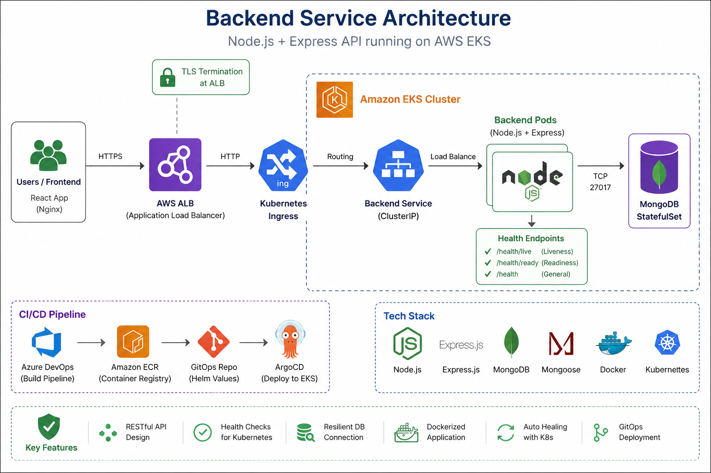

# 🚀 Backend Service — Cloud-Native E-Commerce API

> A production-ready Node.js backend deployed on **AWS EKS** using **Docker, Kubernetes, and GitOps (ArgoCD)**.

---

## 🌐 Overview

This repository contains the **backend API service** of a cloud-native e-commerce platform.

It is built using **Node.js + Express + MongoDB** and designed to run in a **containerized Kubernetes environment**, following modern DevOps and cloud-native practices.

---

## 🎯 Responsibilities

The backend service is responsible for:

- Managing product/items data
- Handling API requests from frontend
- Connecting to MongoDB database
- Exposing health endpoints for Kubernetes
- Ensuring reliability with retry logic

---

## ⚙️ Tech Stack

| Layer | Technology |
|------|-----------|
| Runtime | Node.js |
| Framework | Express.js |
| Database | MongoDB |
| ODM | Mongoose |
| Containerization | Docker |
| CI/CD | Azure DevOps Pipelines |
| Registry | AWS ECR |
| Orchestration | Amazon EKS |
| Deployment | ArgoCD (GitOps) |

---

## 🧩 Architecture Diagram



> Backend service running on Amazon EKS, connected to MongoDB, exposed via Kubernetes Service and AWS ALB Ingress.

---

## 🏗️ Architecture Overview

```text
Frontend (React)
        ↓
AWS ALB Ingress
        ↓
Kubernetes Service
        ↓
Backend Pod (Node.js)
        ↓
MongoDB (StatefulSet)